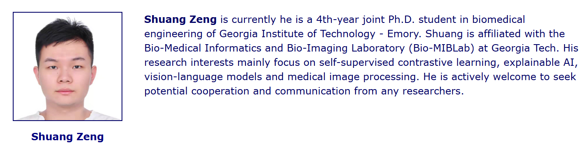








Hi, my name is Shuang Zeng, welcome to my homepage. I received my bachelor's degree in Engineering from Peking Unversity, Beijing, China in 2021. Currently, I am a Biomedical Engineering joint Ph.D. student of Peking University - Georgia Institute of Technology - Emory University. I am very fortunate to be advised by [Prof. Qiushi Ren](https://future.pku.edu.cn/jsdw/jy/swyxgcx1/9b0b9d9a9635465898577c28b0b03c01.htm) from College of Future Technology, PKU and [Prof. May Dongmei Wang](https://www.bme.gatech.edu/bme/faculty/May-Dongmei-Wang) from Wallace H. Coulter Department
of Biomedical Engineering, Georgia Institute of Technology and Emory University. My research interest mainly focuses on self-supervised contrastive learning, Large Language Models, explainable AI and medical image processing. Welcome to reach out to me for communication and cooperation!

# 🔥 News
- *2025.6.1*：
 

 I won the First Prize of the 33rd "Challenge Cup" May Fourth Youth Science Award Competition of Peking University.
  
- *2025.3.20*:
  

 I am honored to be selected to receive a fellowship to attend the [22nd NSF International Summer Leadership Academy on Bio-X: AI in Healthcare, Medicine and Biology](http://2025.biocomplexitysummerschool.org/index.html) on the lovely Mediterranean Island of Rhodes, Greece from May 27th - June 2nd, 2025.
- *2025.2.27*:
  

AAAI (Assocaition for the Advancement of Artificial Intelligence) 2025, Pennsylvania Convention Center, Philadelphia 

 I attended AAAI 2025 conference as a co-author from Feb. 25th to Mar. 4th.

- *2025.2.6*:
  

CRIDC (Career, Research, and Innovation Development Conference) 2025, Gatech, ATL 

 I really appreciate to have the chance to attend CRIDC 2025 poster competition at Georgia Institute of Technology, Atlanta, USA.

# 📝 Publications 

## Journal Articles

- **Shuang Zeng** et al. [Multi-level Asymmetric Contrastive Learning for Volumetric Medical Image Segmentation Pre-training](https://arxiv.org/abs/2309.11876)
- **Shuang Zeng** et al. [SuperCL: Superpixel Guided Contrastive Learning for Medical Image Segmentation Pre-training](https://arxiv.org/abs/2504.14737)
- **Shuang Zeng** et al. [Novel Extraction of Discriminative Fine-Grained Feature to Improve Retinal Vessel Segmentation](https://arxiv.org/abs/2505.03896)
- Xinliang Zhang, Lei Zhu, **Shuang Zeng** et al. [Exploiting Inherent Class Label: Towards Robust Scribble Supervised Semantic Segmentation](https://arxiv.org/abs/2503.13895)
- Bin Qiu, **Shuang Zeng** et al. [Comparative study of deep neural networks with unsupervised Noise2Noise strategy for noise reduction of optical coherence tomography images](https://doi.org/10.1002/jbio.202100151), (Journal of Biophotonics, IF: 2.00)
- Wenbo Zhang, Junmeng Li, Lei Zhu, **Shuang Zeng** et al. [Choroidal Vascularity Index and Choroidal Structural Changes in Children With Nephrotic Syndrome](https://doi.org/10.1167/tvst.13.3.18), (TVST, IF: 2.6)
- Lei Zhu, Xinliang Zhang, Hangzhou He, Qian Chen, Sha Li, **Shuang Zeng** et al. [Branches Mutual Promotion for End-to-End Weakly Supervised Semantic Segmentation](https://arxiv.org/abs/2308.04949) (TNNLS, IF: 10.2)
- Lei Zhu, Junmeng Li, Yicheng Hu, Ruilin Zhu, **Shuang Zeng** et al. [Choroidal Optical Coherence TomographyAngiography: Noninvasive Choroidal VesselAnalysis via Deep Learning](https://pubmed.ncbi.nlm.nih.gov/39257642/) (Health Data Science)

## Conference Proceedings

- Yixin Chen, Xiangxi Meng, Yan Wang, **Shuang Zeng** et al. [LUCIDA: Low-dose Universal-tissue CT Image Domain Adaptation For Medical Segmentation](https://link.springer.com/chapter/10.1007/978-3-031-72111-3_37) *MICCAI 2024*
- Qian Chen, Lei Zhu, Hangzhou He, Xinliang Zhang, **Shuang Zeng** et al. [Low-Rank Mixture-of-Experts for Continual Medical Image Segmentation]([https://arxiv.org/abs/2406.13583](https://link.springer.com/chapter/10.1007/978-3-031-72111-3_36)) *MICCAI 2024*
- Hangzhou He, Lei Zhu, Xinliang Zhang, **Shuang Zeng** et al. [V2C-CBM: Building Concept Bottlenecks with Vision-to-Concept Tokenizer](https://arxiv.org/pdf/2501.04975) *AAAI 2025*

# 🎖 Honors and Awards

- *2019.6*, "Shuyu Xia - Topaz Cen" Undergraduate Internship Scholarship
- *2019.12*, Award for Scientific Research of Peking University 
- *2019.12*, The Third Prize of Peking University Scholarship
- *2020.12*, Merit Student of Peking University 
- *2020.12*, Leo Kaiyuan Scholarship
- *2021.6*, Outstanding Undergraduate Scientific Research Program of School of Engineering, Peking University
- *2021.6*, Excellent Graduate of Peking University
- *2022.12*, Award for Science Research of Peking University
- *2023.12*, Award for Contribution in Student Organizations fo Peking University
- *2024.5*, Outstanding Communist Youth League Member of Peking University
- *2024.6*, The Third Prize of the 32nd "Challenge Cup" May Fourth Youth Science Award Competition of Peking University
- *2024.10* BMEJ fellowship award of Georgia Institute of Technology
- *2024.12*, The Third Prize of Peking University Scholarship
- *2024.12*, Award for Science Research of Peking University
- *2025.3*，NSF fellowship to attend the 22nd International Summer Academy on AI in Healthcare, Medicine and Biology
- *2025.6*, The First Prize of the 33rd "Challenge Cup" May Fourth Youth Science Award Competition of Peking University
- *2025.6*, The Third Prize of the 33rd "Challenge Cup" May Fourth Youth Science Award Competition of Peking University

# 📖 Educations
- *2024.08 - now*, Ph.D. student in [Bio-MIBLab](https://miblab.bme.gatech.edu/), Wallace H. Coulter Department of Biomedical Engineering, Georgia Institute of Technology (Joint GT-Emory-PKU Ph.D. program). 
- *2021.09 - now*, Ph.D. student in [MILab](https://milab-pku.github.io/), Biomedical Engineering, College of Future Technology, Peking University
- *2017.09 - 2021.07*, Bachelor in Biomedical Engineering, College of Engineering, Peking University

<!-- # 💬 Invited Talks
- *2021.06*, Lorem ipsum dolor sit amet, consectetur adipiscing elit. Vivamus ornare aliquet ipsum, ac tempus justo dapibus sit amet. 
- *2021.03*, Lorem ipsum dolor sit amet, consectetur adipiscing elit. Vivamus ornare aliquet ipsum, ac tempus justo dapibus sit amet.  \| [\[video\]](https://github.com/)

# 💻 Internships
- *2019.05 - 2020.02*, [Lorem](https://github.com/), China. -->

